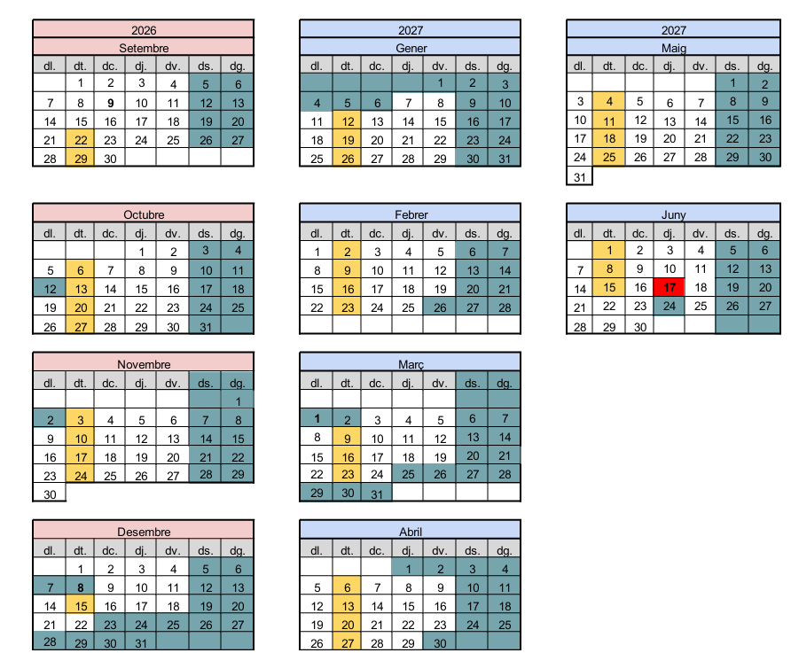

# 📘 Digitalización aplicada a los sectores productivos – 1º de GM
### Profesora: Vanesa Maldonado

Bienvenidos al repositorio oficial de la asignatura **Digitalización aplicada a los sectores productivos** del ciclo de **Sistemes Microinformàtics i Xarxes (SMX)**, curso 2026–2027.

<p align="center">
  
</p>

Enlace Meet: https://meet.google.com/mmj-fego-rfm

---

## 🧩 Resultados de Aprendizaje (RA)

RA1. Establece las diferencias entre la Economía Lineal (EL) y la Economía Circular (EC), identificando las ventajas de la EC en relación con el medioambiente y el desarrollo sostenible.  
RA2. Caracteriza los principales aspectos de la 4.ª Revolución Industrial indicando los cambios y las ventajas que se producen tanto desde el punto de vista de los clientes como de las empresas.  
RA3. Identifica la estructura de los sistemas basados en cloud/nube describiendo su tipología y campo de aplicación.  
RA4. Compara los sistemas de producción/prestación de servicios digitalizados con los sistemas clásicos identificando las mejoras introducidas.  
RA5. Elabora un plan de transformación de una empresa clásica del sector en el que se enmarca el título, basada en una EL, al concepto 4.0, determinando los cambios a introducir en las principales fases del sistema e indicando cómo afectaría a los recursos humanos.  

---

## 🗂️ Estructura del repositorio

```js
/digitalizacion
│
├── unidad1_economia_circular/
├── unidad2_transformacion_digital/
├── unidad3_sistemas_basados_cloud_nube/
└── unidad4_plan_digitalizacion/
```

---

## 📚 Unidades del curso

#### **Unidad 1 – Economía circular**  
📁 [`unidad1_economia_circular`](unidad1_economia_circular)

#### **Unidad 2 – Transformación digital**  
📁 [`unidad2_transformacion_digital`](unidad2_transformacion_digital)

#### **Unidad 3 – Sistemas basados en cloud/nube**  
📁 [`unidad3_sistemas_basados_cloud_nube`](unidad3_sistemas_basados_cloud_nube)

#### **Unidad 4 – Plan de digitalización**  
📁 [`unidad4_plan_digitalizacion`](unidad4_plan_digitalizacion)

