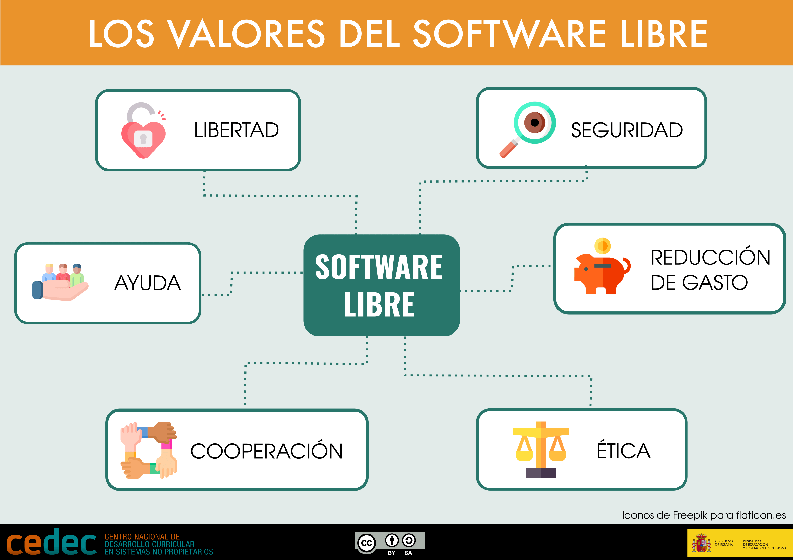

# Digitalización y Software libre

## Digitalización y Software libre

En un contexto en el que la tecnología impregna todos los ámbitos de la vida personal, educativa y profesional, y en concreto, en un módulo formativo de Digitalización, es fundamental entender las implicaciones del tipo de software que utilizamos. Esta reflexión es especialmente relevante en el ámbito educativo y formativo, donde la elección entre software libre y software propietario no solo tiene consecuencias técnicas o económicas, sino también éticas, sociales y pedagógicas.

### Diferencias entre software libre y propietario

Lo primero que debemos tener claro es que software libre no significa necesariamente gratuito, ni que el software propietario implique siempre un coste económico. La diferencia entre ambos modelos no radica en el precio, sino en las libertades que ofrecen al usuario.

El software libre se caracteriza por proporcionar mayores libertades que el software propietario. Mientras que este último está controlado por una persona o entidad que restringe el acceso al código fuente y limita su uso, modificación y redistribución, el software libre garantiza cuatro libertades fundamentales: ejecutar el programa, estudiarlo, modificarlo y redistribuirlo. Estas libertades permiten a los usuarios ejercer un control real sobre la tecnología, fomentan la autonomía digital y promueven el aprendizaje técnico y la colaboración.

A diferencia del modelo propietario, el software libre no tiene un único propietario. Se pone a disposición de la comunidad con el objetivo de favorecer la participación, la transparencia y la mejora continua. De este modo, se impulsa una cultura tecnológica abierta, donde el conocimiento se comparte y se construye de forma colectiva.

### Filosofía y valores del software libre

Más allá de lo técnico, el software libre se sustenta en una filosofía centrada en la ética, la transparencia, la cooperación y la libertad de elección. Su uso contribuye a reducir los costes asociados a licencias y mejora la seguridad, ya que el código puede ser auditado de forma abierta y colectiva. Además, permite evitar modelos de negocio basados en la explotación de los datos personales, frecuentes en muchas plataformas digitales propietarias que, aunque se presentan como gratuitas, obtienen beneficios económicos a partir de la información de sus usuarios.

Por todo ello, resulta recomendable adoptar la filosofía de la libertad digital como una decisión consciente, fundamentada en la responsabilidad personal y en una mirada crítica hacia el uso de la tecnología. Salvo en casos muy específicos que requieran aplicaciones propietarias altamente especializadas, existen alternativas libres para la mayoría de los programas habituales. Aunque estas soluciones no siempre sean idénticas, sus prestaciones suelen ser comparables o incluso superiores, ya que su código ha sido revisado y mejorado por comunidades de desarrolladores que detectan errores y vulnerabilidades de forma más eficiente que los equipos cerrados de las empresas propietarias. El software libre, por tanto, no solo representa una opción técnica válida, sino también un compromiso con una tecnología más justa, abierta y sostenible.

### Valores del software libre

  

### La privacidad en juego

Muchas aplicaciones y servicios digitales recopilan datos personales sin que los usuarios seamos plenamente conscientes, incluso cuando se presentan como gratuitos. El software libre permite proteger mejor la privacidad, ya que su funcionamiento es transparente y respeta los derechos del usuario, de ahí que es importante desarrollar una actitud crítica ante el uso de herramientas digitales y optar por alternativas que garanticen mayor seguridad y control sobre los datos.

## Vinculación del software libre y propietario con la digitalización de la pyme

El análisis del software libre frente al software propietario, resulta clave para acompañar a las pymes en sus procesos de transformación digital, especialmente dentro del marco del Plan de Digitalización de la Pyme (2021–2025). Este plan persigue mejorar la competitividad del tejido productivo mediante el uso estratégico de la tecnología, con un enfoque sostenible, ético e inclusivo.

### 1. Ahorro, sostenibilidad y economía circular

El uso de software libre ofrece una vía realista y eficaz para que las pymes puedan acceder a herramientas tecnológicas sin incurrir en elevados costes de licencias.
Además, permite alargar la vida útil de los equipos informáticos, reduciendo el impacto ambiental y alineándose con principios de economía circular, algo especialmente valioso para microempresas con recursos limitados.

### 2. Industria 4.0 y 5.0: control y personalización

El software libre facilita la incorporación de soluciones flexibles y personalizadas para procesos propios de la Industria 4.0 (automatización, IoT, gestión inteligente de datos).
En el enfoque 5.0, centrado en la integración humano-tecnología y el valor social, el software libre añade una capa ética: permite a las empresas mantener el control sobre sus datos, su infraestructura y sus procesos, reduciendo la dependencia de grandes plataformas y proveedores externos.

### 3. Tecnologías habilitadoras y cloud soberana

Existen múltiples herramientas libres en la nube que pueden ser implementadas por pymes para facilitar su transformación digital: suites ofimáticas colaborativas (como OnlyOffice o LibreOffice Online), plataformas de gestión documental (Nextcloud), herramientas CRM/ERP (Odoo, Dolibarr) o entornos de formación (Moodle).
Estas alternativas refuerzan el acceso a tecnologías habilitadoras con menor coste, mayor transparencia y posibilidad de cloud soberana, controlada directamente por la empresa o proveedores locales.

### 4. Ciberseguridad, privacidad y responsabilidad digital

El software libre permite auditar el código y detectar vulnerabilidades con mayor rapidez. Para muchas pymes, esta característica aporta mayores garantías de seguridad y cumplimiento normativo (RGPD) frente a opciones propietarias que no revelan cómo gestionan los datos.
Además, fomenta una cultura de responsabilidad digital, clave en la digitalización empresarial.

### 5. Formación del personal y cultura digital empresarial

Adoptar software libre no es solo una decisión técnica, sino una oportunidad para formar al equipo humano de la pyme en competencias digitales transversales: trabajo colaborativo, autonomía tecnológica, uso eficiente de recursos y protección de la información.
Estas competencias son imprescindibles para que la transformación digital sea real, sostenible y duradera.

## El papel del software libre en la transformación digital hacia la Industria 4.0 y 5.0

La economía lineal se basa en producir, usar y desechar. Frente a este modelo insostenible, las industrias están evolucionando hacia modelos más circulares, sostenibles y digitalizados. Aquí el software libre aporta herramientas clave para facilitar esta transición:

* Reduce costes de licencias, lo que facilita el acceso a herramientas tecnológicas incluso en entornos con menos recursos.
* Favorece la reutilización y personalización del software, alineándose con la lógica circular de extender el ciclo de vida de los recursos.
* Promueve la soberanía tecnológica: el acceso abierto al código permite que centros educativos, empresas o instituciones adapten y mantengan sus propias soluciones tecnológicas sin depender de proveedores concretos.
* Apoya modelos éticos y sostenibles que comparten conocimiento y evitan obsolescencia programada.

Por otro lado, la Industria 4.0 se caracteriza por la incorporación de tecnologías como IoT, Big Data, automatización y sistemas ciberfísicos en la producción. El software libre es un pilar silencioso pero fundamental en este ecosistema:

* Herramientas como Linux, Arduino, Node-RED, Grafana, FreeCAD, OpenPLC o plataformas de análisis de datos basadas en código abierto son la base de muchos sistemas industriales inteligentes.
* Fomenta el aprendizaje técnico: el código abierto permite al alumnado y profesionales entender el funcionamiento interno de las herramientas que usan.
* Es compatible con los principios de interoperabilidad, fundamentales en entornos donde máquinas, sensores y plataformas deben comunicarse.

Cuando nos referimos a la Industria 5.0, que introduce una visión humana, ética y sostenible de la digitalización industrial, elsoftware libre encaja plenamente en esta visión:

* Permite que las personas participen activamente en la construcción tecnológica, no solo como usuarias sino como creadoras.
* Favorece la inclusión digital: al ser gratuito y accesible, contribuye a democratizar la transformación tecnológica.
* Refuerza los principios de ética tecnológica: transparencia, colaboración, protección de la privacidad y respeto por el entorno.